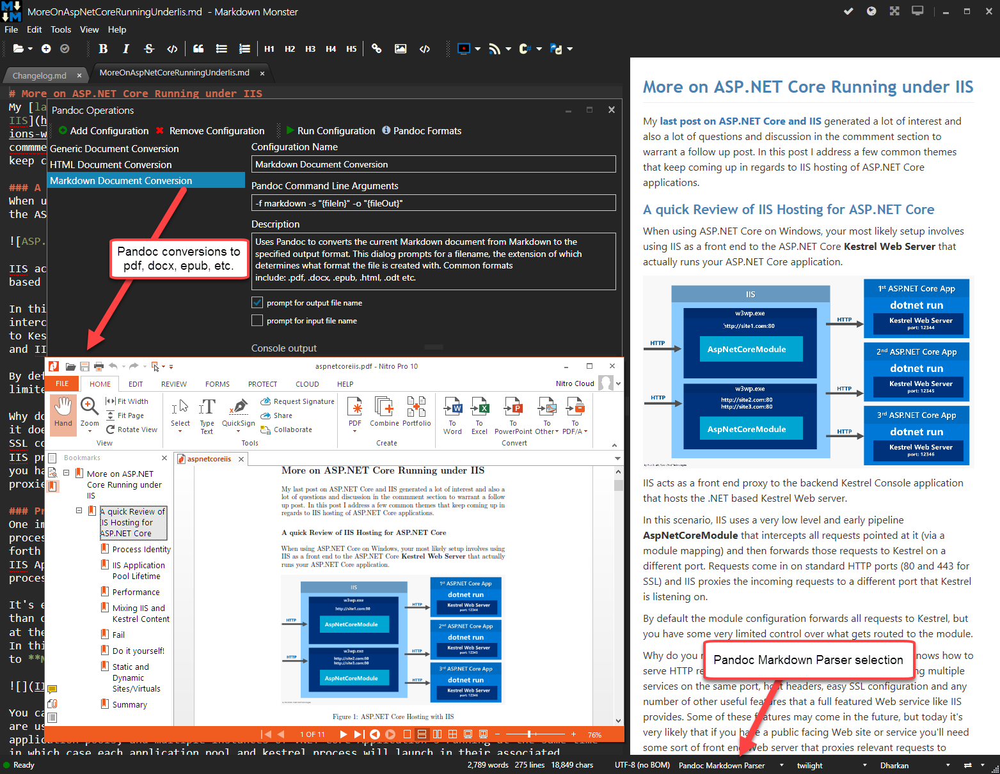
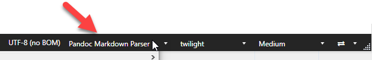
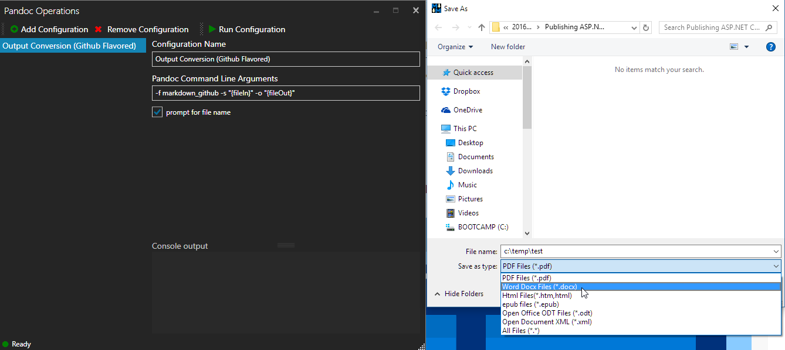

# Pandoc Markdown Parser Addin for Markdown Monster

This addin provides the following for Markdown Monster:

* A Pandoc Markdown Parser for rendering Markdown to Html in the Editor
* A UI for creating and running Custom Command Line Configurations against Pandoc



### Installing the Addin
The addin install from the Markdown Monster Addin Manager. Click **Tools -> Addin Manager** and pick the **Pandoc Markdown Parser** from the list of addins.


### The Markdown Parser
The Pandoc Markdown parser is an addin markdown parser that is made available to Markdown Monster and can be selected in Markdown Monster as the parser for rendering HTML output.

The parser is registered in Markdown Monster and when available can be selected on the Renderer drop down on the bottom of the main window:



> ### No Document Synching
> Currently, due to the lack of **pragma lines support** in Pandoc, the editor and Markdown document cannot be linked automatically as you navigate one or the other document. If document syncing is important to you continue to use the **MarkDig** parser, and then switch to Pandoc parsing when you generate your final output.

### Pandoc Configurations Form and Runner
This addin supports configuring a number of different command line scenarios for running Pandoc and producing various kinds of output from the current document. This will pick up the currently active markdown document and uses it to run pandoc to produce various kinds of output.



You can set up separate configurations with differing output and command line options for running Pandoc.

### Pandoc Installation
This addin does not ship with Pandoc - it's your responsibility to install Pandoc. We recommend you install **Pandoc** and **MikTex** via [Chocolatey](https://chocolatey.org/).

```dos
choco install pandoc
choco install MikTex
```

Alternately you can explicitly install these two tools separately. Both tools register themselves in the System path, so make sure you restart Markdown Monster after installing them.