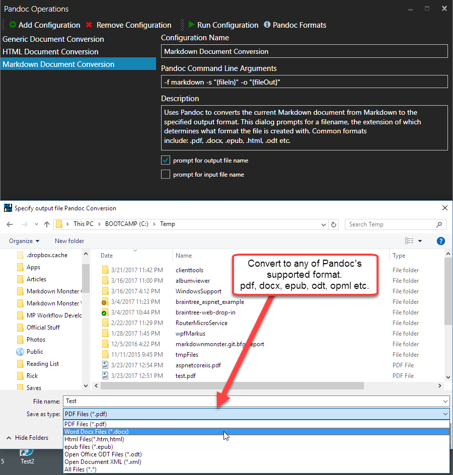

# Pandoc Markdown Parser Addin for Markdown Monster

This addin provides the following for Markdown Monster:

* A Pandoc Markdown Parser for rendering Markdown to Html in the Editor
* A UI for creating and running Custom Command Line Conversions against Pandoc


> #### Pandoc Installation
>This addin does not ship with Pandoc as Pandoc is very large and has redistribution restrictions. It's up to you to install Pandoc on your Windows machine. 
>
> The easiest way to **Pandoc** and **MikTex** (used for PDF/Doc conversions) is via [Chocolatey](https://chocolatey.org/).
>
> ```ps
> choco install Pandoc
> choco install MikTex  
> ```

### Installing and Configuring the Addin
The addin installs from the **Markdown Monster Addin Manager**. Click **Tools -> Addin Manager** and pick the **Pandoc Markdown Parser** from the list of addins to install.

After installation make sure to:

* **Restart Markdown Monster** to make the Pandoc Parser available
* Make sure `Pandoc.exe` is **on the User or System Path** 

If you installed Pandoc via Chocolatey, the Pandoc is automatically available on the path. If you manually installed make sure to add the path to your User or System path and restart Markdown Monster to pick it up.

### The Markdown Parser
The Pandoc Markdown parser is an addin markdown parser that is made available to Markdown Monster and can be selected in Markdown Monster as the parser for rendering HTML output.

The parser is registered in Markdown Monster and when available can be selected on the Renderer drop down on the bottom of the main window:


> ### No Document Syncing
> Pandoc unfortunately **does not have pragma line support** which allows mapping editor to ids in the generated Html output that is used in the previewer.  For this reason the Pandoc parser **does not support Preview Sync** the way the default Markdig parser does.
> 
> Due to this limitation we recommend that you use the default parser for most of your editing tasks, and **use the Pandoc parser to verify correct rendering using Pandoc**. 

### Pandoc Configurations Form and Runner
This addin supports configuring a number of different command line scenarios for running Pandoc and producing various kinds of output from the current document. This will pick up the currently active markdown document and uses it to run Pandoc to produce various kinds of output.



You can set up separate configurations with differing output and command line options for running Pandoc.

Alternately you can explicitly install these two tools separately. Both tools register themselves in the System path, so make sure you restart Markdown Monster after installing them.

### Pandoc Support: Report to Pandoc
This addin is a just a helper that executes Pandoc, so please don't contact us about issues you have with Pandoc conversions. 

You can report bugs and issues to the Pandoc GitHub repository.

#### Pandoc Parser Markdown Limitations
Unlike the default Markdig Markdown parser that is used by Markdown Monster, Pandoc doesn't support line number matching, so a number of features like synced scrolling in the previewer don't work with Pandoc as the Markdown parser.

> For this reason we suggest that you use the default Markdig Markdown Parser while working on your content and switch to the Pandoc parser only to verify that rendering works as expected.

#### Pandoc Resources

* [Pandoc Documentation](https://Pandoc.org/)
* [Pandoc on GitHub](https://github.com/jgm/Pandoc)
* [Pandoc GitHub Issues](https://github.com/jgm/Pandoc/issues)